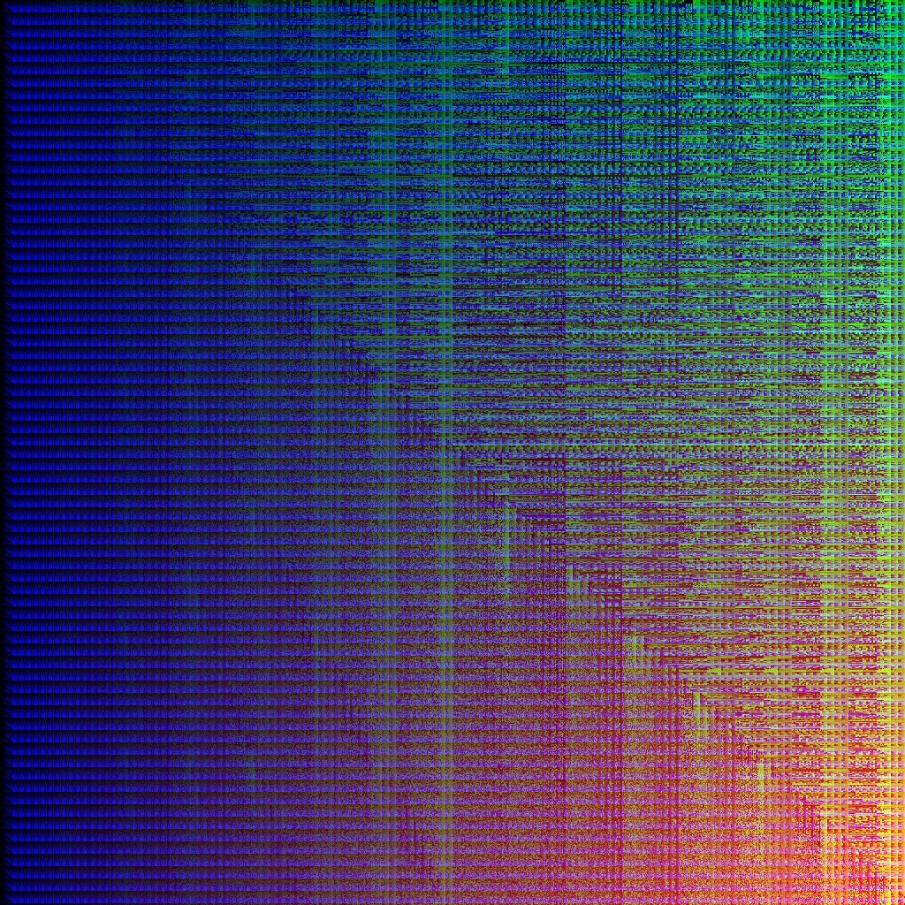

# Bitgrid

A random integer function art making tool

Inspired by <https://freeradical.zone/@bitartbot>, created by <https://freeradical.zone/@suetanvil>

ffmpeg -framerate 25 -pattern_type glob -i "frame*.png" -vf format=yuv420p -movflags +faststart output.mp4

